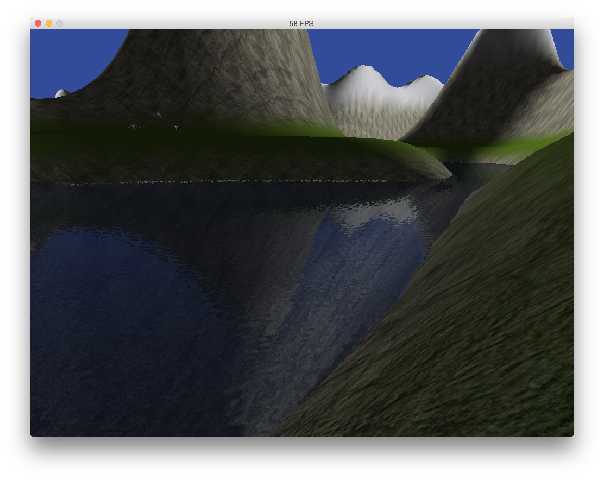
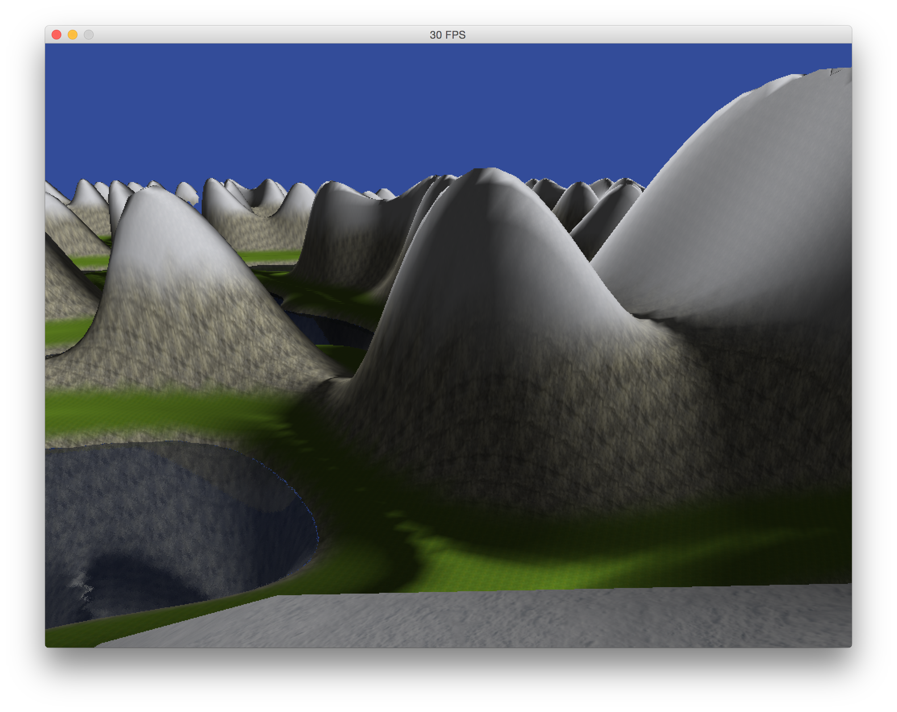

# 3D game engine using modern OpenGL3.2+ 
Written with the sole purpose of improving my skills in graphics programming.
Java is used as my programming language. GLSL is used for shader programs.

Credits for lots of my simplex noise code goes to http://webstaff.itn.liu.se/~stegu/simplexnoise/simplexnoise.pdf . It's an excellent resource to use if you want to learn.

This game(engine) procedurally generates terrain from simplex noise. This makes the terrain "infinite" (not really). Chunk unloading and deletion when no longer needed has yet to be implemented. The seams where the level of detail changes needs a lot more work to look right. 
3D models are loaded using simple loading and parsing of .obj files. Texture mapping is not implemented very well.
Lakes are rendered by drawing the scene two more times to two framebuffers, one for reflection and refraction. The two images are then blended together and rendered to the water surface. Underwater post-processing effects are also implemented, and looks quite nice.

